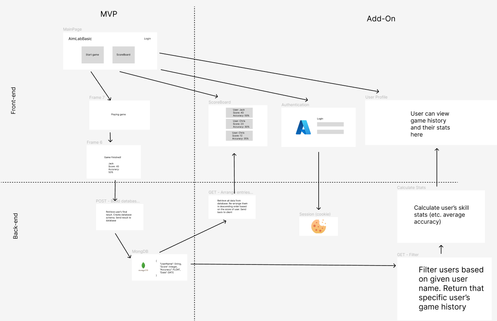

# AimLabBasic

Henry Bao, Lesi Li, Russell Sean Eng, Christopher Ku

## Project Description

Our application AimLabsBasic targets a wide range of audiences including gamers who want to try and learn how to play shooting games, people who want to release their stress by playing a simple game, and other users that simply want to improve their mouse agility and accuracy.

The project is a similar and simpler version of Aim Labs that runs on a web browser instead of a stand-alone application that has to be installed onto the user’s computer, therefore extending the accessibility of the game. The application allows users to check their mouse accuracy and compare it to their past performance to know whether they have improved or not. The reason for users to choose this application is that our application is simple to use, not competitive, and will not create a stressful atmosphere. So users can practice and find familiarity through our application.

As developers, we know the importance of aiming skills in shooter games and understand that there is a market for an aim training game. Our team has a passion for gaming and software development, and we believe our game will benefit a variety of users. We want to provide gamers with an easy and effective way to improve their skills in aiming and have a platform to store their progress along the way.

## Technology Description
Link to architectural diagram mapping and design: https://www.figma.com/file/mh7RuMGjAAf3ShLi5Q24BT/Info-441-Final-Project?node-id=0%3A1&t=0HA6wX39E79dJt6i-0

| Priority      | User  | Description | Technical Description |
| ----------- | ----------- |----------- |--------------  |
| P0      | As a First Person Shooting game player     | I want to practice my mouse agility and accuracy      | Display targets on the website on the client side, and record the user’s accuracy throughout the game using MongoDB       |
| P0 | As a game player | I want to check my scores and accuracy once I finish the game | Keep track of the amount of clicks throughout the game and calculate the score and accuracy at the end of the game |
| P0 | As a game player | I want to store my scores when each time I play the game | Save the final result of each game into MongoDB by user’s id once the game is finished |
| P1 | As a game player | I want to see how much time is left when I am playing the game. | Display a timer countdown on screen whenever a game starts, stops and record results into MongoDB when the timer runs out |
| P2 | As a game player | I want to receive a notification if my latest time has a better score than the last time | Compare the each game’s result with mongodb when user achieved a new high score, send a notification to the client |
| P2 | As a game player | I want to view other users’ scores who also playing the game | Query all users in MongoDB and return them to a leaderboard |
| P3 | As a game player | I want to log in and log out to this application | The user would enter their credentials (username and password) into the login form. The application will then query MongoDB to see if a document exists with those credentials. The user is granted access to the application if a match is found. When the user wants to log out, the application removes the active session or token associated with that user, effectively ending their session and logging them out. |
| P3 | As a game player | I want to create and review my profile. | Session will record the user’s information once the user creates a new account in the application. The mangoDB will update if the user changes their information. |
| P3 | As a user | I want the application can remember my login information so that I don't need to enter my user id and password again | Session will record the user’s information |
| P4 | As a recureiter form esport | I want to see which player has the potential to become a professional gamer by checking the scoreboard | Database send all player stats to the server. The server re-orders players based on score and accuracy. Send to front-end. |

## Functions

1. Login
2. Logout
3. Profile
4. Check scores
5. View other users' scores
6. Check accuracy
7. Time limitation (30s-60s)
8. Store score and accuracy
9. Session
10. Pause & continue (client side)
11. Stop & Quit (client side)
12. Break performance history

## Endpoints

* USE “/user” - Navigate to user route
* USE “/scoreboard” - Navigate to scoreboard route
* USE “/game” - Navigate to game route
* USE(req, res, next) - Connect database
* POST “/game/game-result” - Send the final result of a player to the database
* GET “/scoreboard/score” - Request all player scores from the database and send back to front-end
* GET “/user/login” - For user to login (Azure Authentication)
* GET “/” - Session

## Appendix

Database Schema:  
	{  
    “UserName”: String,  
    “Email”: String,  
    “Score”: Integer,  
    “Accuracy”: Float  
    “Date”: Date  
}

Link to architectural diagram mapping and design: https://www.figma.com/file/mh7RuMGjAAf3ShLi5Q24BT/Info-441-Final-Project?node-id=0%3A1&t=0HA6wX39E79dJt6i-0